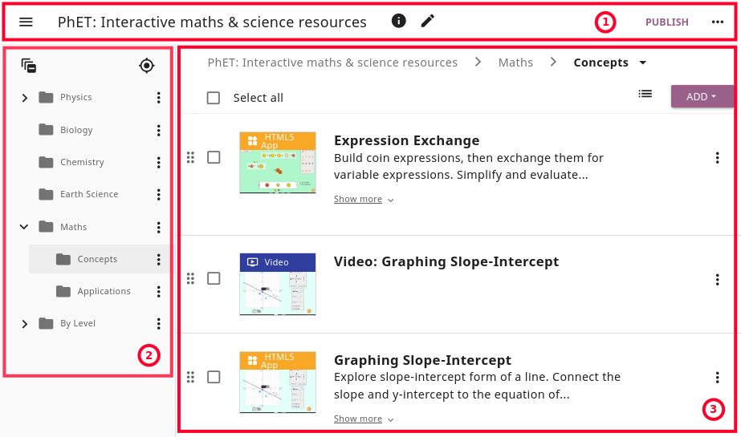
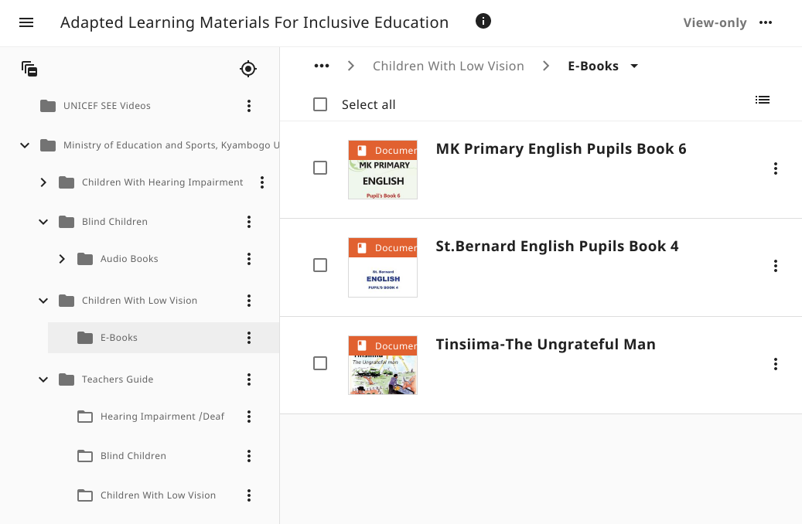
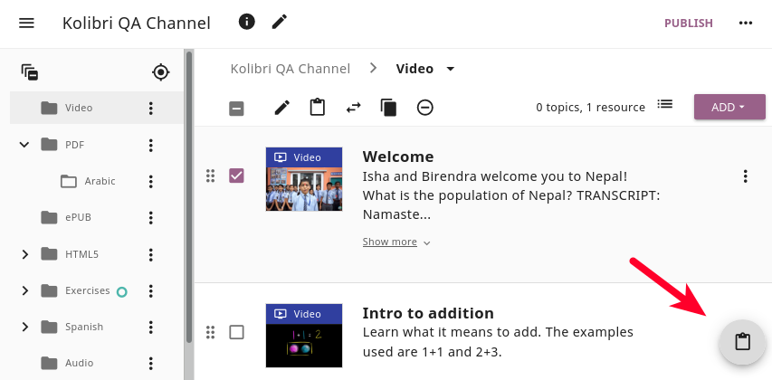
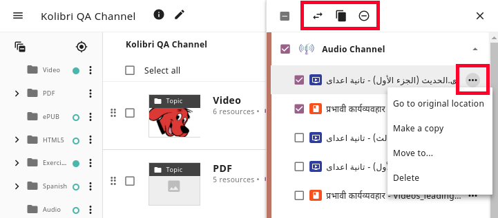

.. _add_content:

Manage channel resources
########################

You can open and explore all the channels in Kolibri Studio, but you will have more options when viewing channels that you have permissions to edit.

   Explore or edit Kolibri channel page.

#. **Topbar**

   .. figure:: img/edit-channel-page-topbar.png
      :alt: 

   a. |menu| Open sidebar button
   #. Channel title
   #. |info| :ref:`View channel details <view_channel_details>`
   #. |edit| Edit channel details (available **only on your channels**)
   #. :guilabel:`PUBLISH` button (if viewing your channel) or **View only** label
   #. |optionsHorizontal| More channel options

#. **Topic tree sidebar**

   .. figure:: img/edit-channel-page-sidebar.png
      :alt: 

   g. |collapseAll| Collapse all opened topics
   #. |myLocation| Expand to current topic location
   #. |chevronRight| (unfold) or |chevronDown| (collapse) a |topic| (topic) folder
   #. |optionsVertical| More topic options
   
#. **Topics and resources panel** (for the currently selected folder)
   
   k. Breadcrumbs menu
   l. |unchecked| Select all topics or resources in the folder
   m. |list| Select the :ref:`View <adjust_view>` 
   n. :guilabel:`ADD` topics or resources 
   
   .. figure:: img/edit-channel-page-panel.png
      :alt:       
      
   **Single topic and resource options**

   o. |dragVertical| Drag and drop to preferred location
   p. |unchecked| Select single topic or resource (to :ref:`edit, move, copy...<edit_content_tools>`)
   q. |optionsVertical| More topic or resource options
   
   (bottom right corner)

   r. |clipboard| Button to open the Studio :ref:`Clipboard <clipboard>`.

.. tip:: Before you start building channels in Kolibri Studio, you should dedicate some time to plan the channel structure and how should the topics be organized - by subject, source, learner's age, etc. Use the checklist in the :ref:`Appendix <appendix>` to help you plan. 

.. TODO - cross-link with relevant documents from the EdToolkit.

Channel structure
=================

Channel is a collection of resources and `metadata <https://en.wikipedia.org/wiki/Metadata>`_ organized into a topic tree structure. For example, the Khan Academy channel has 4 levels of nested topics:

| **Domain > Subject > Topic > Tutorial**
| *e.g. Math > Arithmetic > Fractions > Comparing fractions*

Channels aligned to a specific state curriculum might instead be structured as:

| **Grade > Subject > Unit**
| *e.g. Fifth Standard > Math > Unit 5*

Channel topic tree
******************

Inside each channel the individual learning resources (exercises, videos, audio or document files) are organized in groups of related resources in a structure called a **channel topic tree**, similar to how files are organized in folders on a computer.

Think of the topics as folders that can contain other sub-folders (sub-topics) or files (learning resources) directly. A folder in the topic tree can contain both individual resources and sub-folders.

   Topic > Sub-topic > Resource structure of the Kolibri channel.

There is no inherent restriction on the depth of topic trees or the number of resources that you can place in a channel. However, you should take into consideration the intended learning pathway and user experience once channel is imported in Kolibri, and try to build your topic tree so that learners do not need to click through long series of subfolders to arrive to the desired learning resource.

.. _adjust_view:

Adjust the view 
***************

Use the **View** |list| button to select between *Default*, *Comfortable* or *Compact* view of the topic tree.

   .. figure:: img/topic-tree-view.png
      :alt: You can toggle between the views

      Toggle between different views of the topic tree.

Status indicators
*****************

While you import, upload or edit resources in your channels, you will see status indicators for topics and resources changes.

   .. figure:: img/status-indicators.png
      :alt: 

* |unpublishedResource| **Unpublished resource** status indicates that you have added new resources or topics to the channel since the last time it was published.
* |unpublishedChange| **Unpublished change** status indicates that you have changed some resources' or topics' metadata since the last time it was published.
* |warningIncomplete| **N incomplete resources** status indicates that some of the resources are missing the required metadata, and that you need to provide them before publishing. 
* |error| **All N incomplete resources** status indicates that all resources in the topic are missing some required metadata, and that you need to provide them before publishing. 

.. _add_topics:

Add topics
==========

To create one or more new topics in a channel, follow these steps.

#. Click the :guilabel:`ADD` button.
#. Select **New topic**.
#. Complete the topic information (title, description, language, thumbnail image) and metadata (licensing information, tags). 

   .. note:: Setting the topic language is optional: if you don't set it, it will default to the language of the parent topic; if it is the root topic, it will default to the language set for the whole channel.

#. Click :guilabel:`ADD NEW TOPIC` button in the sidebar to add several topics at once.

   .. tip:: Use the checkboxes on the left to select topics, edit and change details or metadata, or |close| buttons to delete topics in this same window. 

#. Click the :guilabel:`FINISH` button to return to the main topic tree view.

.. _upload:

Upload files
============

.. tip:: When you create learning resources and materials to upload on Studio and use in Kolibri, make sure to take in consideration diverse learner needs and abilities.

   Read the :ref:`Best practices for creation of inclusive learning content <a11y_content>` section for guidelines and resources on how to make accessible learning resources.

..  raw:: html

    <iframe width="670" height="380" src="https://www.youtube-nocookie.com/embed/28Kk7D9Y3tY?rel=0&modestbranding=1&cc_load_policy=1&iv_load_policy=3" frameborder="0" allow="accelerometer; gyroscope" allowfullscreen></iframe>  

    Captions for the video are available in English, French and Arabic.      

Studio currently supports the upload of the following file formats for individual learning resources:

-  :ref:`MP4 - video files <video>`
-  MP3 - audio files
-  :ref:`PDF - document files <pdf>`
-  ePUB - ebook files
-  :ref:`ZIP - packaged HTML5 <html5>`

.. warning:: There is an initial storage limit of **500MB** for the files that you upload to Kolibri Studio. You can :ref:`keep track of the used storage <settings>`, and request more if necessary, from the **My Settings > Storage** page.

To upload individual learning resources into your channel, follow these steps.

#. Click  :guilabel:`ADD` button.
#. Select **Upload Files** option.
#. Click :guilabel:`SELECT FILES` button or drag and drop the files inside the window.

   .. figure:: img/add-more-files.png
         :alt: Add individual learning resources to channel.

         Add individual learning resources to channel.

   .. note:: There is no general ideal size for each individual upload, and upload times and ideal number of resources per upload will largely depend on the available Internet connection.

#. While uploading files, the system extracts some file information like filenames and thumbnails for videos. Once the upload is finished, you can adjust the name of the file, add lower/higher resolution option, and captions for videos.

   .. figure:: img/edit-upload.png
         :alt: Change or add file details.

         Change or add file details.

#. You can also delete extracted thumbnails, generate (|generateThumbnail|) them from resources, or upload (|image|) your own. 

   .. figure:: img/generate-thumbnails.png
         :alt: Generate thumbnails from resources.

         Generate thumbnails from resources.

#. Scroll down to the **Source** section to edit the resource metadata. If you uploaded more than one file, select each file in the sidebar on the right to edit the respective metadata. 

   .. tip:: Adding the **appropriate metadata** to each resources item, and following the **consistent style for filenames and tags** will impact the search functionality, and you should keep it in mind in order to ensure the findability of the learning resources included in your channels. 

   .. figure:: img/edit-metadata.png
         :alt: 

         Add metadata to files.

   .. warning:: Remember to select the `appropriate license <https://learningequality.org/r/kolibri-licenses>`_ in case you are adding files to a channel that you plan to release publicly. 
      
      You can select a **Special Permissions** license and customize the description, in cases where the available licenses do not match the resources permissions.

         .. figure:: img/add-special-permissions.png
               :alt: 

               Add Special Permissions license.

#. Click the :guilabel:`FINISH` button to return to the main topic tree view.

.. _video:

Video files
***********

.. tip:: **Recommendations for upload of video files**

         There is no limit to video resolution or file size set by Kolibri Studio platform itself. However, keep in mind that the total channel size will impact the experience of the Kolibri administrator who will have to import and update it on the local Kolibri installation, and the size of the individual videos will impact the experience of the learners viewing it using Kolibri. Therefore, **prefer smaller and low resolution video files**.  

Additionally, you can add subtitles to videos, set the language, and preview them prior to publishing.

   .. figure:: img/captions.png
      :alt: 

      Add captions to videos.

.. _pdf:

PDF files
*********

It is recommendable that documents in PDF format are also uploaded in small digestible chunks, for examples up to 20 pages at a time. 

If you are including bitmap images into the PDF documents, try to optimize them and reduce their size prior to exporting the final PDF file.

.. _html5:

HTML5 applications
******************

Kolibri Studio supports a special **HTML5 App** format, which allows for rich, dynamic content such as games, interactive documents, and simulations. The format consists of a **ZIP** file containing HTML5 resources such as HTML, CSS, and JS files. These resources will be rendered within an *inline frame* in the Kolibri application.

.. tip:: **Guidelines for structure of the HTML5 apps**

   * There must be an **index.html** file at the top level within the ZIP file.
   * All resources referenced from HTML pages must be relative, pointing to files within the ZIP file — not online sources.
   * JavaScript is allowed, but some features (e.g. popup windows, alerts) are disabled.
   * Video files (mp4) should be progressive download and no more than 480p resolution.
   * Audio files (mp3) should not exceed 128kb bit rate.

.. _exercises:

Create exercises
================

Captions for the video are available in English, French and Arabic.

..  raw:: html

    <iframe width="670" height="380" src="https://www.youtube-nocookie.com/embed/59j8la43Ow4?rel=0&modestbranding=1&cc_load_policy=1&iv_load_policy=3" frameborder="0" allow="accelerometer; gyroscope" allowfullscreen></iframe>  

In Kolibri you can create exercises that contain a set of interactive questions (numeric, multiple choice, check all that apply, or true or false) that learners can engage with. With exercises, learners will receive instant feedback on whether they answer each question correctly or incorrectly. For each exercise you can set the mastery criteria, and Kolibri will cycle through the available questions in an exercise until learners achieve mastery. It is also possible to set the question/answer/hint order, indicate whether to randomize the order of questions/answers, and add images and formulas to questions, answers, and hints.

Mastery criteria
****************

Kolibri marks an exercise as completed when learners meet the mastery criteria. Here are the different types of mastery criteria for an exercise:

* **2 in a row**
   Learner must answer two questions in a row correctly
* **3 in a row**
   Learner must answer three questions in a row correctly
* **5 in a row**
   Learner must answer five questions in a row correctly
* **10 in a row**
   Learner must answer ten questions in a row correctly
* **100% Correct**
   Learner must answer all questions in the exercise correctly (not recommended for long exercises)
* **M out of N**
   Learner must answer M questions correctly from the last N questions answered (e.g. 3 out of 5 means learners need to answer 3 questions correctly out of the 5 most recently answered questions).

To create an exercise, follow these steps.

#. Click the :guilabel:`ADD` button.
#. Select **New exercise** option.
#. Edit the exercise in the **Details** tab to:
      
   a. Set the exercise title, description and tags
   b. Select the mastery criteria 
   c. Choose if the questions are randomized
   d. Add/Change the thumbnail 
   e. Select language and visibility
   f. Fill in the copyright information

#. Use the **Questions** tab to:

   * Add the question text and images in the question editor field
   * Select the answer type (single/multiple, true/false or numeric input)
   * Provide answers for each question 
   * Provide hints for each question
   * Randomize answer order

   .. figure:: img/edit-content-questions.png
         :alt: Exercise Questions tab options.

         Exercise Questions tab options.

#. Click the :guilabel:`NEW QUESTION` button to add a new question to the exercise. Question editor field offers similar options as a basic text editor. You can format the text to be bold, add image files, undo and redo actions.

   .. tip:: You can resize images by selecting them and dragging the corners to achieve the desired size.

#. Click the :guilabel:`NEW ANSWER` button to add answer(s) to the question. Answer editor field offers the same formatting options as the question editor. 

   Keep clicking the :guilabel:`NEW ANSWER` button to add as many answers as you want for the single and multiple selection types of questions.

      .. warning:: Remember to activate the radio button for the correct answer. You can easily distinguish the correct answer by the green highlight and green left border, from the incorrect answers that have only the red border. 

#. Click the :guilabel:`NEW HINT` to add hints for the question. Hint editor field offers the same formatting options as the question and answer editors.

   Keep clicking the :guilabel:`NEW HINT` button to add as many hints as you want for the question.

      .. tip:: You can delete and reorder answers and hints with the |chevronUp|, |chevronDown| and |close| icons in the upper right corner.

      .. figure:: img/reorder-answers.png
            :alt: Reorder questions, answers and hints.

            Reorder questions, answers and hints.

#. Use the **Related** tab to recommend resources that the learner should view or complete prior to the current one:

   .. figure:: img/edit-content-prerequisites.png
         :alt: Add Related for the current exercise.

         Add Related for the current exercise.

   .. note:: Related resources in Kolibri display as recommendations alongside the resource that a learner is currently engaging with.

      .. figure:: img/add-related.png
         :alt: 

         Related resources display as recommendations for the current exercise.

#. Click the :guilabel:`FINISH` button to return to the main topic tree view.

.. _import_content:

Import resources from other channels
====================================

To import topics or resources from other channels, either those that you published previously or those that are publicly available, follow these steps.

#. Click the :guilabel:`ADD` button.
#. Select **Import from channels** option. 

#. Select the resources you want from **Import from other channels** dialog. This window will display all the channels that you can import resources from. You can select the whole topics or individual resources to import. The total size and number of the resources you are importing is displayed in the summary at the bottom of the dialog.

#. Use the search field to look for a specific topic or resource among the available channels, and activate the checkbox .

   .. figure:: img/import-search.png
      :alt: Import resources from Channels with Search option.

      Import resources from channels by searching.

#. Click the :guilabel:`REVIEW` button at the bottom to review the selected resources.

#. Click :guilabel:`IMPORT` when you are done. You will see the progress bar while the selected resources and topics are being copied into your channel. 

   .. warning:: The server’s capacity per import is currently approximately 100 resources. When importing over 100 resources, you will need to import in multiple chunks. The number highlighted in blue next to each checked section indicates the number of resources in that section.

   .. tip:: Remember to :ref:`publish the channel <publish_channel>` each time you make changes or updates to channel resources.
      

.. _clipboard:

Use the clipboard to import resources
*************************************

Another option for copying resources between channels is to use the **Clipboard**.

   Open the clipboard sidebar.

* Click the |clipboard| button at the right bottom corner of the page to open the clipboard sidebar.
* Select a resource and use the buttons |edit| to edit, |move| move, and |remove| delete resources from the clipboard.
* Or click the |optionsHorizontal| button to access the menu and manage each resource without selecting it.

   Tools to manage resources in the clipboard.

.. _copy_content:

To import resources into clipboard, follow these steps
^^^^^^^^^^^^^^^^^^^^^^^^^^^^^^^^^^^^^^^^^^^^^^^^^^^^^^

1. Open the channel that contains topics or resources you wish to import.
2. Select the topics or resources to copy.
3. Use the |clipboard| button from the :ref:`Edit topics and resources tools <edit_content_tools>`
   
   OR
   
   Click the |optionsVertical| and select to **Copy to clipboard** option. 

   .. figure:: img/copy-to-clipboard.gif
      :alt:  

      You can copy resources from other channels into your clipboard.

To import resources from clipboard, follow these steps
^^^^^^^^^^^^^^^^^^^^^^^^^^^^^^^^^^^^^^^^^^^^^^^^^^^^^^

1. Open the destination channel.
2. Open the clipboard.
3. Drag and drop any topic or individual resources into the appropriate topic or subtopic of the destination channel.

   OR

   Select a resource and use the |move| (move) button in the clipboard toolbar.
      
   OR

   Click the |optionsVertical| and select to **Make a copy** option. 

   .. warning:: This action will **move** the resources from the clipboard to the destination channel. If you want to maintain the resources in the clipboard available for import in your other channels, you will need to make a copy first. 

   .. figure:: img/clipboard.gif
      :alt:  

      You can copy resources from the clipboard into your channels.

.. _sync:

Sync imported resources
***********************

Resources imported from other channels can change over time. Use the **Sync** option to update any imported resources with their original source resources. Features that can be updated include resource files (videos, assessment items, tags, title and description details, etc.). To sync imported resources follow these steps.

1. Click the |optionsHorizontal| button in the topbar and select to **Sync resources** option.
2. Select which fields you want to sync and click the :guilabel:`CONTINUE` button.
3. Click the :guilabel:`SYNC` button to proceed, or :guilabel:`BACK` to exit without syncing.

   .. figure:: img/sync-content.png
      :alt: Sync imported resources to keep them up-to-date.

      Sync imported resources to keep them up-to-date.

.. _edit_content_tools:

Edit topics and resources tools
===============================

When you select a topic or a resource, you will see a toolbar that contains the following options:

   a. |edit| :ref:`Edit details <edit_content>`
   b. |clipboard| :ref:`Copy selected to Studio clipboard <copy_content>`
   c. |move| :ref:`Move selected <move_content>`
   d. |copy| :ref:`Make a copy <copy>`
   e. |remove| :ref:`Delete <delete_content>`

.. _edit_content:

Edit details
************

To edit details for each topic/subtopic or individual resource, follow these steps.

#. Click the |optionsVertical| (options) button and select **Edit details** option. 

   **OR** 
   
   Right-click the resource or topic itself and select **Edit details**. |br|

#. Make the necessary changes in the **Edit details** window:

   a. Edit the general data (title, description, license, metadata, etc.) for the content item in the **Details** tab.

   b. If your content item is an :ref:`exercise <exercises>`, you can review and preview the included questions, and add additional ones in the **Questions** tab.
   
   c. Use the **Related** tab to recommend resources that the learner should view or complete prior to the current one.

#. Click the :guilabel:`FINISH` button return to the main topic tree view.
  

.. _set_role_visibility:

Set visibility by role
^^^^^^^^^^^^^^^^^^^^^^

Content visibility determines the type of Kolibri users that can see whole topics, subtopics or single resources. You have the option to leave the default option of visibility for *Anyone*, or set it so it's visible only to *Coaches* (teachers, facilitators, administrators).

To set a topic, subtopic or a single resource as a **Coach support resource**, follow these steps.

#. Scroll down the **Details** tab to find the **Audience** heading.

#. Select *Coaches* from the **Visible to** drop-down menu: 

   .. figure:: img/coach-resource.png
            :alt: Set the visibility of the resource so only coaches can see it.

            Set the visibility of the resource so only coaches can see it.

#. Click the :guilabel:`FINISH` button return to the main topic tree view. 

Topics or resources that are set to be visible only to coaches will be marked with the |coachContent| icon inside the channel on Studio, and in the **Learn** page in Kolibri.

   .. figure:: img/coach-resource2.png
            :alt: Resource visible only to coaches in Kolibri Learn page.

            Resource visible only to coaches in Kolibri Learn page.           

.. _move_content:

Move
****

To move topics or resources from one location to another, follow these steps.

#. Use the checkbox to select the topic or individual resource and click the |move| (move)button.

   **OR**

   Click the |optionsVertical| (options) button and select **Move** option. 

   **OR** 
   
   Right-click the resource or topic itself and select **Move**. 

   **OR**

   Directly drag and drop the content item to the destination topic or subtopic. |br|

#. Select the desired location in the **Moving...** window.
#. Click the button :guilabel:`MOVE HERE` or :guilabel:`CANCEL` to exit without moving.

.. _copy:

Make a copy
***********

Use the checkbox to select the topic or individual resource and click the |copy| (copy) button.

   **OR**

   Click the |optionsVertical| (options) button and select **Make a copy** option. 

   **OR** 
   
   Right-click the resource or topic itself and select **Make a copy**. 

.. _delete_content:

Remove and restore
******************

* To **remove** topic, subtopic or a resource from the channel, follow these steps.

   * Use the checkbox to select the topic or individual resource and click the |remove| (remove) button.

      **OR**

   * Click the |optionsVertical| (options) button and select **Remove** option. 

      **OR** 
      
   * Right-click the resource or topic itself and select **Remove**. |br|

* To **restore** deleted topic, subtopic or a content item, follow these steps.

   1. Click the |optionsHorizontal| (options) button in the topbar and select **Open trash** option.
   #. Select the checkbox of the topics, subtopic or a content item you want to restore from the **Trash** window.

   #. Click the :guilabel:`RESTORE` button to restore them to their original position, or :guilabel:`DELETE` to permanently delete them.
   #. Click the |close| (close) button to return to the topic tree view and remember to publish the changes to the channel.
