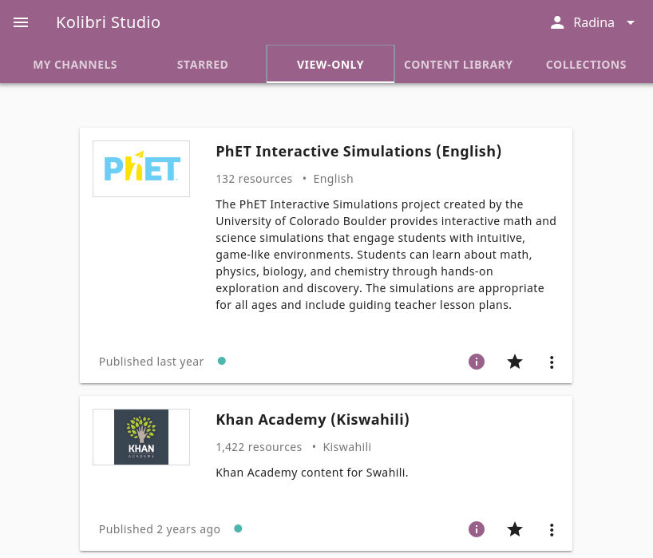
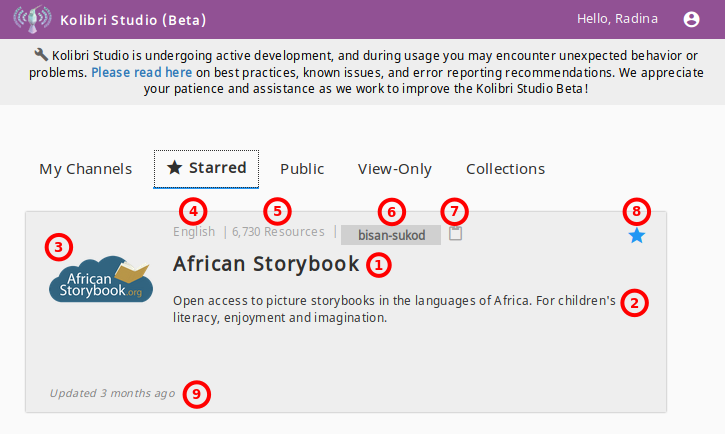
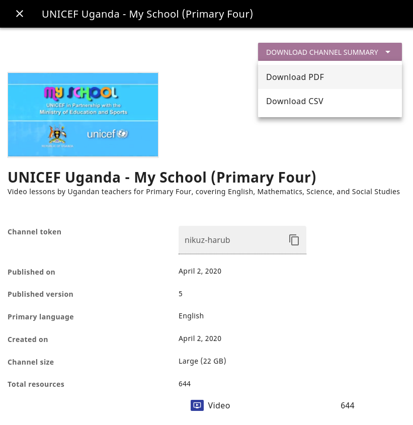

.. _work_channel:

Explore channels on Kolibri Studio
##################################

When you login to Kolibri Studio, you will be able to see Kolibri channels organized in 5 different tab views:

#. **My Channels** tab with the list of channels you created previously, that you can update with the new materials if necessary, and publish again.

#. **Starred** tab with the channels that you flagged for quick access.

#. **View-Only** tab for channels for which you received an invitation to view by other Kolibri Studio users, and can import content from.

#. **Content Library** tab with channels that the Learning Equality team made available from publicly available source content.

#. **Collections** tab, where you can manage packages of multiple Studio channels associated with a unique token.

   Kolibri Studio channels by type.

.. tip:: To return to the **My channels** page from any location in Studio, click the |menu| button to open the sidebar and select **Channels**.

Channel details
===============

In the main view you can see basic information for each of the channels:

   Basic channel information.

#.  Channel name
#.  Thumbnail image 
#.  Channel language
#.  Channel description
#.  Number of resources (exercises, videos, audio or document files)
#.  Latest update indicator
#.  |info| Channel details
#.  |starBorder| Add to starred channels

Click the |optionsVertical| (options) button to access further options: 

#.  |edit| Edit channel details
#.  |copy| Copy the channel token to your clipboard
#.  |trash| Delete channel

.. note:: The term **Channel ID**, a `32 digit unique identifier <https://en.wikipedia.org/wiki/Universally_unique_identifier>`_, was used in Kolibri versions up to 0.6, while from the Kolibri version 0.7 onward, we exclusively use the term **token** to uniquely designate each channel.

.. _view_channel_details:

View channel details page
*************************

Click the |info| button to open the page with the extended channel information.

   Page with extended channel information.

Provides information about:

* token needed for import (use the |copy| button)
* type of resources channel contains (exercises, videos, HTML5 apps or documents)
* number of resources and storage used
* languages offered
* content creators and license holders
* preview of the topics included

.. note:: You can download the channel summary in **PDF** and **CSV** formats. Click the **Download channel summary** button, select the format and save the file to your device.

Manage channels
===============

Create a new channel
********************

To create a new channel, follow these steps.

#. Click the :guilabel:`NEW CHANNEL` button.
#. Name the new channel and add a description.
#. Select the channel language from the dropdown selector.
#. Click the placeholder image or the |image| button, and upload an image for the channel thumbnail if desired (optional).
#. Fill in the copyright information (author, provider, aggregator, license)
#. Click :guilabel:`CREATE` button to finish creating the channel, and the channel will be available in your **My Channels** list.

Now that you have created the channel, you can :ref:`proceed to add and organize content in the channel <add_content>`.

Edit channel details
********************

* From the **My Channels** page, click the |optionsVertical| (options) button and select |edit| **Edit channel details**.
* From the **Edit channel details** page, click the |edit|  button in the topbar.

Delete channel
**************

To permanently delete the channel follow these steps.

* From the **My Channels** page, click the |optionsVertical| (options) button and select |trash| **Delete channel**.
* Scroll to the bottom of the **Edit channel details** page and click the :guilabel:`DELETE CHANNEL` button.

.. warning:: Deleted channel cannot be restored.

Manage channel collections
==========================

Channel **collection** is a package of multiple Studio channels all associated with its unique *collection* token. Once you have made a collection, you can use its token to import multiple channels at once in Kolibri, as you no longer need to import channels with their individual tokens.

.. warning:: You will need Kolibri version 0.12.0 or higher to import channel collections.

Create channel collection
*************************

To create a collection of channels follow these steps.

#. Go to **Collections** tab and click the :guilabel:`NEW COLLECTION` button.

#. Type in the name for your collection and click the :guilabel:`SELECT CHANNELS` button.
   
#. Search for the channels you want to add to collection.

   .. figure:: img/new-collection-tabs.png
      :alt: 

      Search for channels to add to collection.

#. Use the checkboxes  to select channela you want to add to your collection. 

#. Click the :guilabel:`FINISH` button to save the selection, and :guilabel:`SAVE AND CLOSE` button to return to the main collections view.

#. Use the **collection token** (same location as channel tokens) to import collection of channels into Kolibri.

Edit Channel Collection
***********************

To edit a collection of channels follow these steps.

#. Click the :guilabel:`OPTIONS` button for the selection you want to edit and select |edit| **Edit collection**.
#. Edit the title and click the :guilabel:`SELECT CHANNELS` button to add or remove channels.
#. Click the :guilabel:`FINISH` button to save the selection, and :guilabel:`SAVE AND CLOSE` button to return to the main collections view.
